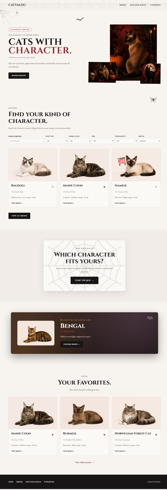
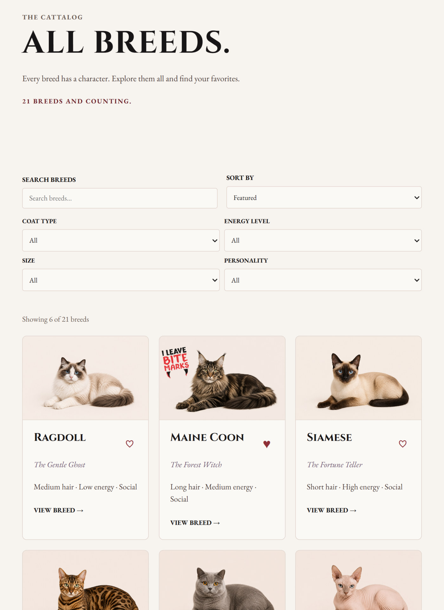
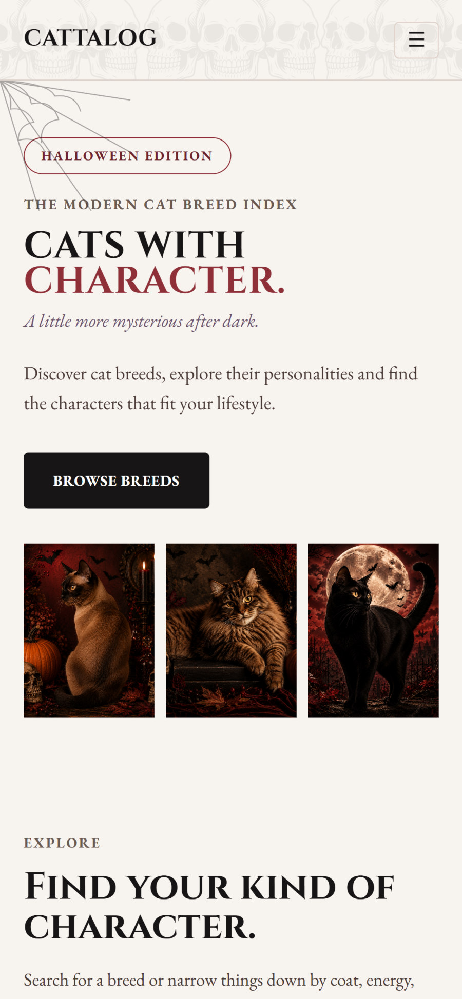
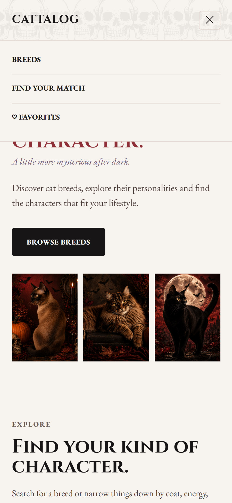
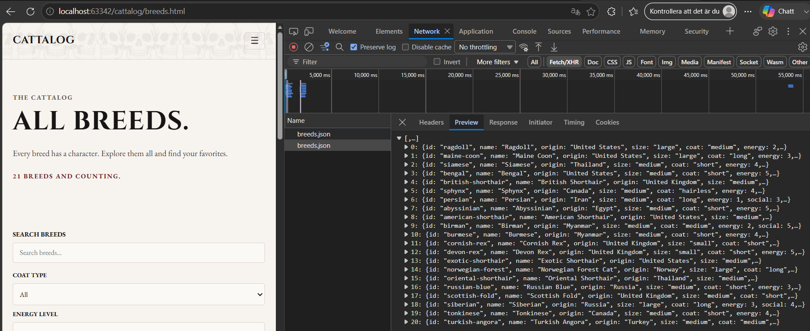
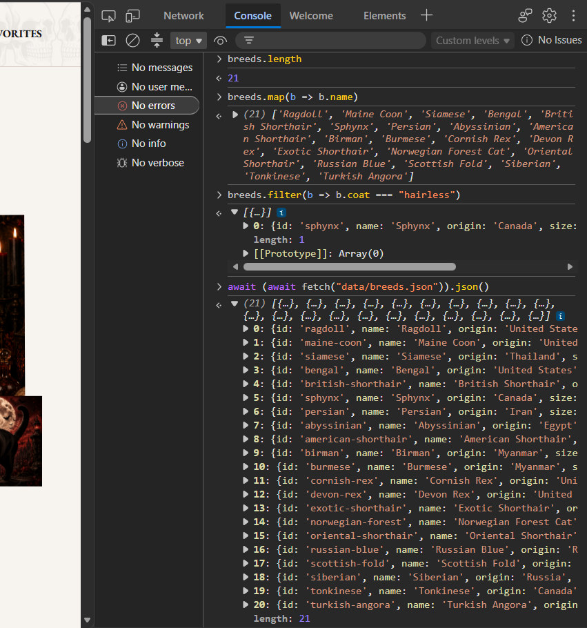
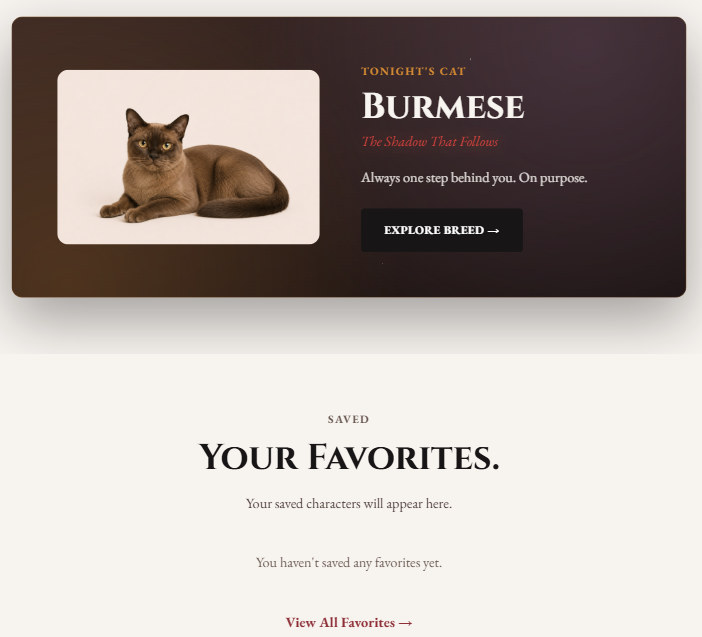
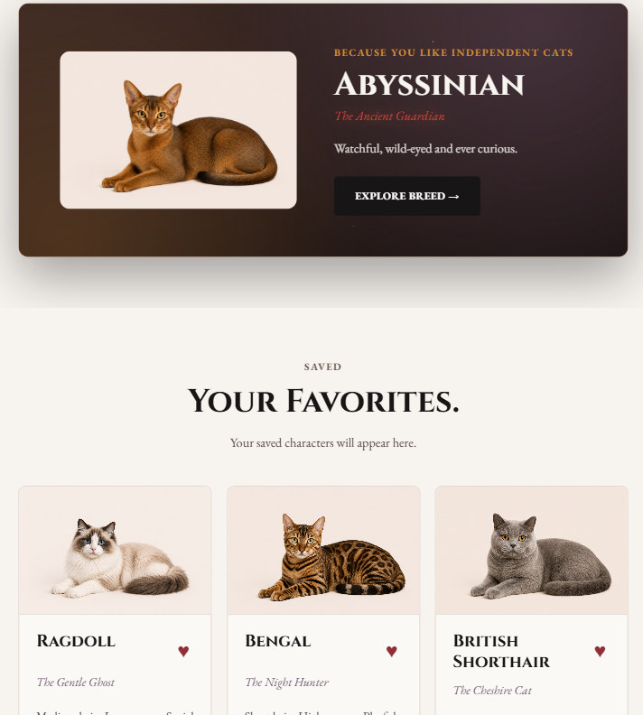
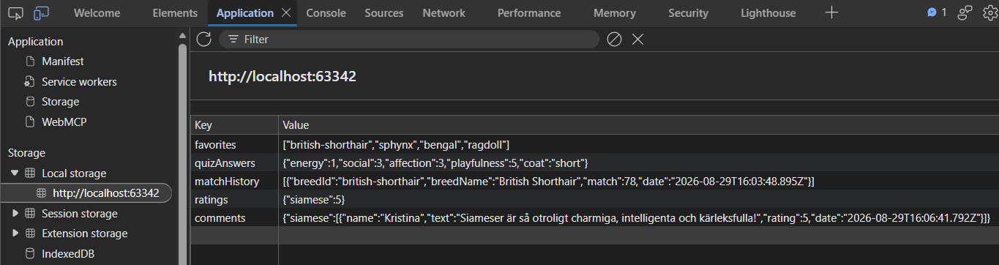

## Documentation

How the site works: the responsive approach with screenshots for desktop, tablet
and mobile, the choice of typefaces and color, how breed data is fetched with
`fetch` and rendered on the client, how `localStorage` holds the visitor's data,
how the project is tested, and suggestions for improvement.

[Back to README](../README.md)

---

### Responsive design

The layout is built with CSS Grid and Flexbox. The base styles target desktop and
are adjusted downward with two breakpoints. Headings also scale smoothly with
`clamp()` instead of jumping at an exact width.

| Breakpoint | View | Change |
| --- | --- | --- |
| `max-width: 900px` | Tablet | Smaller headings, tighter grid. Search and Sort move to their own row above the four attribute filters, which sit in a 2×2 grid. Background decorations are hidden. |
| `max-width: 600px` | Mobile | The breed grid goes from three columns to two. The menu becomes a hamburger that expands vertically. The hero collage is replaced by a row of three images. The filters stack into one column. |

The breed grid follows the same principle on every view that shows breed cards:

```css
.breed-grid {
    display: grid;
    grid-template-columns: repeat(3, 1fr);
    gap: 24px;
}

@media (max-width: 600px) {
    .breed-grid {
        grid-template-columns: repeat(2, 1fr);
        gap: 12px;
    }
}
```

The mobile menu is toggled by an `is-open` class that `js/nav.js` adds to `<nav>`
when the hamburger button is clicked:

```css
@media (max-width: 600px) {
    .main-nav           { display: none; }
    .main-nav.is-open   { display: flex; }
}
```

**Desktop** – hero in two columns with an overlapping image collage, filters on
one row, breed grid in three columns.



*Fig. 3.1 – Home page, 1440 px.*

**Tablet** – the search field and sorting share the top row, the attribute filters
sit in a 2×2 grid below, the grid is tighter.



*Fig. 4.1 – breeds.html, ~800 px.*

**Mobile** – the menu sits behind the hamburger button, the hero images line up
three across, the grid has two columns.



*Fig. 5.1 – Home page on mobile.*



*Fig. 5.2 – Menu expanded.*

---

### Typography and color

Two serif typefaces from Google Fonts, both with a fallback stack (`Georgia,
"Times New Roman", serif`) in case Fonts fails to load:

| Role | Typeface | Reason |
| --- | --- | --- |
| Headings | Cinzel | Roman-capital, epitaph-like feel that carries the theme. |
| Body | EB Garamond | Neutral, readable serif for longer passages. |

Body text sits around 1 rem with a generous line height; on tablet both the font
size and line height are pulled down slightly.

The colors were picked in Adobe Color and live as CSS variables in `:root`:


| Variable | Value | Use |
| --- | --- | --- |
| `--color-background` | `#f7f3ef` | Cream background |
| `--color-surface` | `#fbf9f6` | Cards and panels |
| `--color-text` | `#171515` | Near-black body text |
| `--color-accent` | `#8f3038` | Muted blood red – buttons, links, accents |
| `--color-purple` | `#6c526d` | Halloween accent |
| `--color-pumpkin` | `#d48a32` | Halloween accent |

Contrast was checked with the WebAIM Contrast Checker. Dark text on the light
background is well above WCAG AA. Accent red on a light background passes AA for
normal text; on a dark background it is used as a fill, not as text.

---

### Data: fetch and JSON

All breed data lives in `data/breeds.json` – an array of 21 objects. Each object
has an `id` (used in the URL to the profile page), a name and origin, attributes
such as `size`, `coat` and `energy`, a personality list, and a `halloweenRole`.
A shortened example:

```json
{
  "id": "ragdoll",
  "name": "Ragdoll",
  "origin": "United States",
  "size": "large",
  "coat": "medium",
  "energy": 2,
  "social": 5,
  "personality": ["social", "affectionate", "calm"],
  "halloweenRole": {
    "title": "The Gentle Ghost",
    "tagline": "Drifts from room to room and haunts your lap."
  },
  "image": "images/ragdoll.png"
}
```

The HTML pages contain no breed data – just empty containers. The data is fetched
in `js/utils.js` with `async`/`await`, and `response.ok` is checked before the
response is parsed as JSON:

```js
async function getBreeds() {
    const response = await fetch("data/breeds.json");

    if (!response.ok) {
        throw new Error("Could not load breeds.json");
    }

    return response.json();
}
```

Around it sits a thin wrapper that each page calls with a success and an error
callback, so the failure can be handled where it happens:

```js
function loadBreeds(onSuccess, onError) {
    getBreeds()
        .then(onSuccess)
        .catch(error => {
            console.error("Could not load breeds:", error);

            if (onError) {
                onError(error);
            }
        });
}
```

On `breeds.html` the grid is filled once the data arrives, and if the request
fails a message is shown instead of the cards:

```js
loadBreeds(
    data => {
        breeds = data;

        breedCountSummary.textContent = `${breeds.length} breeds and counting.`;

        const filters = getFilterValues(filterElements);
        showResults(sortBreeds(filterBreeds(breeds, filters), filters.sort));
    },
    () => {
        breedGrid.innerHTML = `
            <p>Something went wrong loading the breeds.</p>
        `;
    }
);
```

Each card is built in JavaScript from a breed object (`createBreedCard` in
`utils.js`) and inserted into the container. The filter selections are mirrored to
the query string with `history.replaceState`, so a filtered list can be shared by
link and survives a reload.

In DevTools the request shows up under **Network** (Fetch/XHR filter):
`breeds.json` with status 200 OK, and the full JSON array in the **Preview** tab.



*Fig. 9.1 – the fetch call to breeds.json, status 200, the response expanded in Preview.*

The data can also be inspected straight from the **Console** – here the number of
breeds and a list of every name, plus the same `fetch` run by hand:



*Fig. 9.2 – `breeds.length` returns 21; `breeds.map(b => b.name)` lists the names.*

---

### Saving to Local Storage

Five keys, all stored as JSON strings:

| Key | Contents |
| --- | --- |
| `favorites` | Array of breed ids, e.g. `["siamese","bengal"]` |
| `ratings` | Rating per breed, `{"siamese": 5}` |
| `comments` | Comments per breed (name, text, rating, date) |
| `quizAnswers` | The answers from the quiz |
| `matchHistory` | The most recent matches, max 10 |

All reads and writes happen inside `try/catch`, so a full or disabled storage does
not crash the page. The value is also validated after parsing:

```js
function getFavorites() {
    try {
        const favorites = localStorage.getItem("favorites");
        const parsed = favorites ? JSON.parse(favorites) : [];
        return Array.isArray(parsed) ? parsed : [];
    } catch (error) {
        console.error("Could not read favorites:", error);
        return [];
    }
}

function toggleFavorite(id) {
    let favorites = getFavorites();

    if (favorites.includes(id)) {
        favorites = favorites.filter(favoriteId => favoriteId !== id);
    } else {
        favorites.push(id);
    }

    try {
        localStorage.setItem("favorites", JSON.stringify(favorites));
    } catch (error) {
        console.error("Could not save favorites:", error);
    }
}
```

The "Tonight's Cat" card on the home page reads `favorites`. Once the visitor has
saved some breeds, it recommends a breed they have *not* saved that shares a
personality trait with the ones they have, and shows which trait ("Because you
like independent cats"). The trait is picked from a random starting point so the
suggestion varies between visits. With no saved favorites the card falls back to a
breed that rotates by the day.



*Fig. 8.1 – No favorite saved – the daily fallback breed.*



*Fig. 8.2 – After three breeds are saved, the card recommends an unsaved breed
that matches a shared trait. The favorites also show further down the page and
stay after a reload.*

Under **Application → Local storage** in DevTools every key is visible with its
JSON contents:



*Fig. 8.3 – The five keys in the browser's storage.*

---

### Quality assurance

- **W3C Markup Validation** – every HTML page validated with no errors.
- **W3C CSS Validation** – no errors. The validator warns about `container-type`
  and `cqw` units because they are newer, but they are supported in modern
  browsers.
- **Browsers** – tested in Chrome and Firefox.
- **Responsive** – tested in the DevTools device mode around the breakpoints
  (390, 800, 1100, 1280, 1440 px).
- **Keyboard** – buttons and links are reachable with tab and have a visible focus
  state (outline, border or ring).
- **Error handling** – `fetch` checks `response.ok`; all `localStorage` code sits
  inside `try/catch`.
- **Form validation** – the comment form combines HTML5 attributes (`required`,
  `minlength`, `maxlength`) with custom JavaScript that gives clear error messages
  (a rating must be chosen, name at least 2 characters, comment 10–300 characters)
  and a live character counter.

---

### Improvement suggestions

- **Cache the data** – every page does its own `fetch`. The response could be
  stored in `sessionStorage` and only fetched the first time.
- **Manage favorites/ratings** – a "clear all data" button and export/import to a
  file would give the visitor control over their stored data.
- **More images per breed** – each breed has a single image today; a small gallery
  would make the profile pages richer.
- **Backend** – comments and ratings are local. With an API they could be shared
  between visitors and survive a change of device.
- **Image optimization** – the cards load full-size PNGs. `loading="lazy"` is in
  place, but `srcset` and smaller files would speed up the mobile view.
